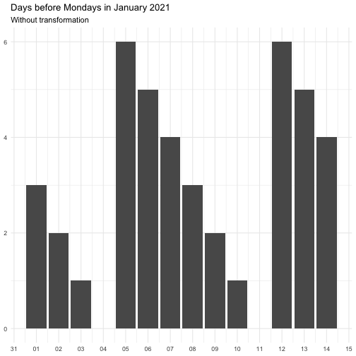
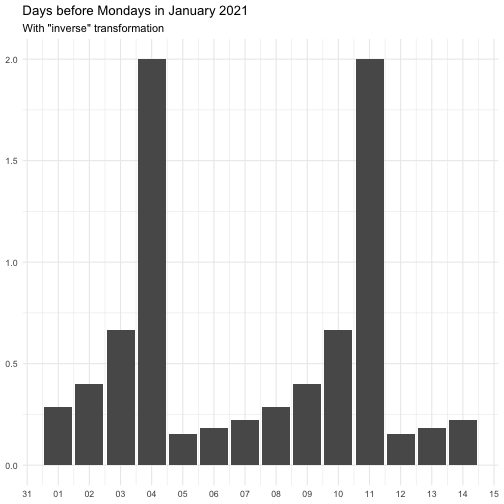
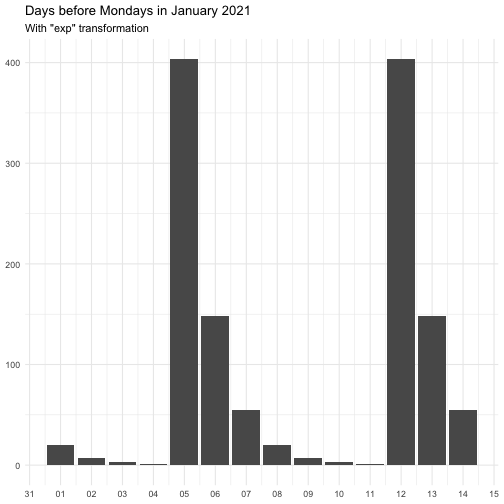
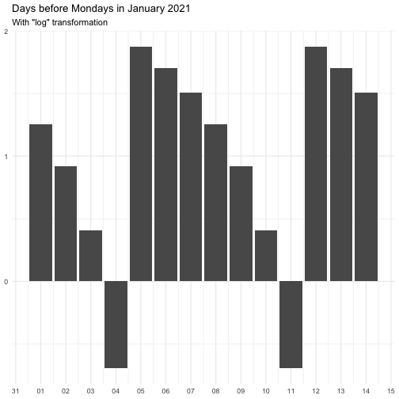

# Time before Recurrent Date Time Event

`step_date_before()` creates a *specification* of a recipe step that
will create new columns indicating the time before an recurrent event.

## Usage

``` r
step_date_before(
  recipe,
  ...,
  role = "predictor",
  trained = FALSE,
  rules = list(),
  transform = "identity",
  columns = NULL,
  keep_original_cols = FALSE,
  skip = FALSE,
  id = rand_id("date_before")
)
```

## Arguments

- recipe:

  A recipe object. The step will be added to the sequence of operations
  for this recipe.

- ...:

  One or more selector functions to choose variables for this step. See
  [`selections()`](https://recipes.tidymodels.org/reference/selections.html)
  for more details.

- role:

  Not used by this step since no new variables are created.

- trained:

  A logical to indicate if the quantities for preprocessing have been
  estimated.

- rules:

  Named list of `almanac` rules.

- transform:

  A function or character indication a function used oon the resulting
  variables. See details for allowed names and their functions.

- columns:

  A character string of variables that will be used as inputs. This
  field is a placeholder and will be populated once
  [`recipes::prep.recipe()`](https://recipes.tidymodels.org/reference/prep.html)
  is used.

- keep_original_cols:

  A logical to keep the original variables in the output. Defaults to
  `FALSE`.

- skip:

  A logical. Should the step be skipped when the recipe is baked by
  [`bake()`](https://recipes.tidymodels.org/reference/bake.html)? While
  all operations are baked when
  [`prep()`](https://recipes.tidymodels.org/reference/prep.html) is run,
  some operations may not be able to be conducted on new data (e.g.
  processing the outcome variable(s)). Care should be taken when using
  `skip = TRUE` as it may affect the computations for subsequent
  operations.

- id:

  A character string that is unique to this step to identify it.

## Value

An updated version of `recipe` with the new check added to the sequence
of any existing operations.

## Details

The `transform` argument can be function that takes a numeric vector and
returns a numeric vector of the same length. It can also be a character
vector, below is the supported vector names. Some functions come with
offset to avoid `Inf`.

    "identity"
    function(x) x

    "inverse"
    function(x) 1 / (x + 0.5)

    "exp"
    function(x) exp(x)

    "log"
    function(x) log(x + 0.5)

The effect of `transform` is illustrated below.



The naming of the resulting variables will be on the form

    {variable name}_before_{name of rule}

## Examples

``` r
library(recipes)
library(extrasteps)
library(almanac)
library(modeldata)

data(Chicago)

on_easter <- yearly() %>% recur_on_easter()
on_weekend <- weekly() %>% recur_on_weekends()

rules <- list(easter = on_easter, weekend = on_weekend)

rec_spec <- recipe(ridership ~ date, data = Chicago) %>%
  step_date_before(date, rules = rules)

rec_spec_preped <- prep(rec_spec)

bake(rec_spec_preped, new_data = NULL)
#> # A tibble: 5,698 × 3
#>    ridership date_before_easter date_before_weekend
#>        <dbl>              <int>               <int>
#>  1     15.7                  83                   5
#>  2     15.8                  82                   4
#>  3     15.9                  81                   3
#>  4     15.9                  80                   2
#>  5     15.4                  79                   1
#>  6      2.42                 78                   0
#>  7      1.47                 77                   0
#>  8     15.5                  76                   5
#>  9     15.9                  75                   4
#> 10     15.9                  74                   3
#> # ℹ 5,688 more rows
```
